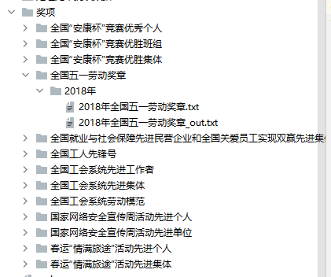
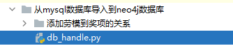

# knowledge
工会知识图谱可视化

# 1.项目流程
## 1.1 收集数据
    首先，从工会公众号收集数据，保存到txt文件，放入到奖项文件夹下，目录结构如下:

    其中out文件为处理好空行后的数据，处理代码为：

    这是个大工程量，目前只保存了2018年的
## 1.2 处理数据
    处理数据就是将txt文件，通过抽取属性保存到mysql数据库
    处理代码为：

## 1.3 从mysql数据库导入到neo4j数据库实现可视化
    代码为：
